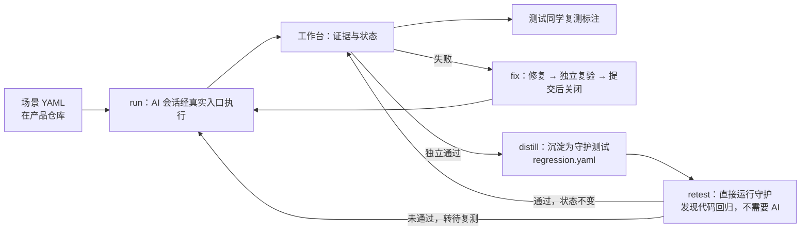

# Flow Board

> 以业务 SOP 场景为中心的验收工具：AI 会话经真实入口执行场景、留证；测试同学在看板上按场景复测；修复由独立会话复验；哪些场景要验收由业务变化（场景内容）决定，代码改动不让已有通过失效；通过的场景沉淀成低成本守护测试，用来发现代码回归。

命令名为 `sop-board`，运行在开发者本机。

## 核心闭环


```mermaid
flowchart LR
    S[场景 YAML<br/>在产品仓库] --> R[run：AI 会话经真实入口执行]
    R --> B[工作台：证据与状态]
    B --> T[测试同学复测标注]
    B -->|失败| F[fix：修复 → 独立复验 → 提交后关闭]
    F --> R
    B -->|独立通过| D[distill：沉淀为守护测试<br/>regression.yaml]
    D --> G[retest：直接运行守护<br/>发现代码回归，不需要 AI]
    G -->|通过，状态不变| B
    G -->|未通过，转待复测| R
```

- **场景文件是唯一真相**：场景 YAML 放在产品仓库，随分支与 worktree 走；会话直接编辑，开发者审核提交。看板按场景内容指纹记录结果，产品快照只记下取证时的代码版本。
- **一条路径**：所有 AI 工作都经 `sop-board` 命令完成。看板上的“AI 重跑”只是用同一份技能启动一个无头会话。
- **多 worktree**：同一项目的 main 与各个 git worktree 自动识别为不同检出，结果、快照、环境端口和浏览器各自隔离。
- **环境按产品来**：仓库与服务只是本机搭环境的材料，不要求全部在运行；用不到某个服务的场景照常执行，本机暂时不具备条件的场景记未执行（不改变状态），意外故障才记受阻。需要依赖故障的场景用 `sop-board env stop|start <服务>` 模拟，提交时自动恢复。
- **自带浏览器**：看板守护进程启动固定版本的 Google Chrome for Testing（每个身份一份持久 profile、各检出共用，缺省无头），不接管你日常用的 Chrome。
- **自动署名**：登记以本机操作者（缺省 `git config user.name`）署名，会话不再反复询问确认人；草稿的确认人是在看板上同意它的测试同学。

## 快速开始

```sh
uv tool install <本仓检出路径>
sop-board skills install                    # 安装随包技能到 Codex 与 Claude Code
sop-board browser install                   # Playwright 1.64.1 + Chrome for Testing
sop-board init demo /path/to/app /path/to/lib
sop-board guide                             # 按指引写 config.yaml、adapter 与项目验证技能
sop-board serve demo --lan                  # 看板守护进程：工作台、环境、浏览器、无头会话
sop-board check
```

多人共享验收记录（一个研发验证过的场景，另一个研发启动同一个产品后也能看到）：在一台常驻机器上起 PostgreSQL（部署与备份见 [参考手册](docs/reference.md#12-多人共享共享库产品与机器)）。每台机器在本机看板“设置 → 共享库”填写连接与密码、测试连接，再选择加入或新建产品。密码保存到本机数据目录的 config.yaml（权限 600），页面只显示“已保存”；也可照旧省略密码配置，用 `~/.pgpass` 提供。会话会给出设置页链接，由使用者操作，不经手密码。已写好连接、尚未绑定的项目仍可用：

```sh
sop-board init demo                         # 列出共享库里的产品（不自动绑定）
sop-board init demo --new                   # 第一个人新建产品；其他人 sop-board init <项目> --join <产品 ID>
```

结论（Agent 通过与失败、人工标注、修复关闭）在产品内共享并按分支归属；受阻、跳过与守护未通过只影响产出它的机器和检出；证据文件留在产出机器上，别的看板经产出机器的看板（`--lan`）读取。没配共享库时一切照旧在本机 SQLite。

之后在产品仓库的 Codex / Claude Code 会话中直接说“执行 SOP 验收”“这几步改动怎么安排验收”“修复这个失败场景”“把通过的场景沉淀成回归测试”“合并收件箱里的用例”即可，随包 `sop-board` 技能会调用对应命令。

## 角色与入口

| 谁 | 在哪里 | 做什么 |
| --- | --- | --- |
| 测试同学 | 内网工作台 | 按场景查看四要素与证据，按“待人工复核”筛选复核 Agent 独立通过的场景，复测标注（通过、不通过、阻塞、需求变更）；在“草稿”筛选中对照检查清单与 SOP 规则原文审阅草稿，批注或逐条、按节点同意（草稿由会话确认，确认人是同意人）；答复问题、上传用例或 SOP |
| 开发者 | 本机工作台、终端 | 启动守护进程、AI 重跑、运行守护、沉淀、审核并提交会话的改动 |
| AI 会话 | 产品仓库中的 Codex / Claude Code | 写 SOP、合并用例、执行场景、修复、复验、沉淀守护测试 |

## 常用命令

| 场景 | 命令 |
| --- | --- |
| 看状态 | `sop-board status` |
| 执行待执行场景 | `sop-board run prepare` → 按 prompt.md 执行 → `sop-board run submit --run N` |
| 让独立会话执行 | `sop-board run launch --scope <场景>…`，`sop-board run wait` |
| 运行守护测试检查代码回归 | `sop-board retest` |
| 沉淀守护测试 | `sop-board distill prepare` → 写测试与 guard.json → `sop-board distill submit` |
| 修复 | `sop-board fix prepare` → 改代码 → `fix submit` → 另一会话 `run prepare --fix N` → 提交后 `fix close` |
| worktree | `sop-board checkout list`，`sop-board checkout create <名称>` |
| 真人登录与验证 | `sop-board browser open --identity <身份> --headed`，完成后 `browser release` 交还（窗口不关） |
| 看各服务状态、模拟依赖故障 | `sop-board env status`；运行中 `sop-board env stop <服务>` / `env start <服务>` |
| 接入共享库 | 首选本机看板“设置 → 共享库”；已写连接时，`init <项目>` 列出产品 → 使用者选择 → `init <项目> --join <ID>` 或 `--new` |
| 验收别人实现的功能 | `sop-board run submit --run N --implemented-by <实现者的操作者>` |

## 文档

| 文档 | 内容 |
| --- | --- |
| [`sop-board guide`](src/sop_board/guide.md) | 搭建项目：config.yaml、适配契约、验证技能 |
| [docs/standard.md](docs/standard.md) | 业务验收与质量改进标准（唯一正文） |
| [docs/sop-guide.md](docs/sop-guide.md) | SOP 业务场景怎样写 |
| [docs/reference.md](docs/reference.md) | 命令、文件契约、状态、错误码 |
| [docs/playwright-acceptance.md](docs/playwright-acceptance.md) | Web 场景与浏览器代理 |
| [docs/design.md](docs/design.md) | v10 设计与取舍 |
| [docs/verification.md](docs/verification.md) | 本仓自身的验收方法 |
| [docs/sop/](docs/sop) | 本仓现行验收场景集 |
